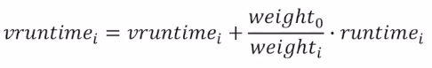

- 비례 / 공정 배분 스케줄러
	- 개요
		- 각 작업에게 CPU의 일정 비율을 보장하는 것을 목표로 함
		- 반환 시간이나 응답 시간에 최적화되어 있지 않음
	- 기본 개념
		- 추첨 스케줄링 (lottery-based scheduling)
		- 티켓
			- 프로세스가 할당받아야 하는 자원의 비율을 나타낸다
			- 티켓의 비율이 할당받을 시스템 자원의 비율과 일치한다
			- 예시: 전체 100개의 티켓 중 75개의 티켓을 가진 프로세스 A는 CPU의 75%를 할당받고, 25개의 티켓을 가진 프로세스 B는 CPU의 25%를 할당받는다
		- 스케줄러가 **승리한 티켓**을 결정하고, 해당 티켓을 가진 프로세스의 상태를 로딩하고 실행한다.
			- 이 과정이 많이 반복될수록 의도된 비율대로 프로그램이 자원을 할당받을 가능성이 증가한다.
		- 티켓 화폐
			- 전역 티켓 화폐 단위와 개별 프로세스 내의 티켓 화폐 단위가 다를 수 있다
			- 프로세스 내에서 자체 화폐 단위로 쓰레드들에게 티켓을 분배하면, 이것이 전역 화폐 단위로 변환되어 실제로 동작하는 방식
		- 티켓 양도
			- 다른 프로세스에게 일시적으로 티켓을 넘겨줄 수 있게 하는 기법
			- 클라이언트/서버 환경에서 클라이언트가 서버에게 보낸 요청이 빨리 처리될 수 있도록 하기 위해서 자신의 티켓을 양도하는 상황 등에 유용하게 사용된다
		- 티켓 팽창
			- 프로세스가 더 많은 CPU 시간을 필요로 할 때, 일시적으로 티켓의 수를 늘이도록 시스템에 요청할 수 있음
			- 서로 신뢰하지 않는 프로세스들이 상호 경쟁하는 시나리오에서는 의미가 없음
	- 구현
		- 
		- `U`: 불공정 지표
			- 첫 번째 작업이 종료된 시간을 두 번째 작업이 종료된 시간으로 나눈 값
			- 공정 배분 스케줄러는 해당 값은 1에 근접하게 만드는 것을 목표로 한다
			- 
			- 추첨 스케줄러는 작업이 충분한 기간 동안 실행되어야 원하는 결과에 가까운 값을 얻을 수 있다.
	- 결정론적 접근: 보폭 스케줄링
		- 기본 개념
			- 각 작업은 보폭 (티켓 수에 반비례) 값을 가짐
			- 임의의 큰 값을 티켓 수로 나누어 보폭을 계산할 수 있다
			- 프로세스가 실행될 때마다 pass라는 값을 보폭만큼 증가시켜 CPU 사용량을 추적
			- 가장 적은 pass 값을 가진 프로세스를 선택하여 실행
		- 장단점
			- 장점: 각 스케줄링 주기마다 정확한 비율로 CPU를 배분할 수 있음
			- 단점: 상태 정보를 필요로 하며, 따라서 신규 프로세스가 추가되는 상황 등에 적절히 대응하기 힘들다 (pass 값을 몇으로 결정할 것인지?)
	- 활용례
		- 각 작업에 티켓을 얼마나 할당할 것인지를 적절히 결정하기 어렵기 때문에, 일반적인 환경에서는 잘 사용되지 않음
		- 티켓 할당량을 비교적 정확하게 결정할 수 있는 환경에서 유용하게 사용됨 (가상화 데이터 센터에서 환경별로 사용할 CPU 사이클을 비율로 나누려고 하는 경우 등)
- Completely Fair Scheduling (CFS)
	- 현재 리눅스의 CPU 스케줄러로 사용되고 있음
	- 특징
		- 고정되지 않은 타임 슬라이스
		- Nice value를 활용한, 우선순위 기반 스케줄링
		- 효율적인 프로세스 관리를 위해 Red-Black Tree를 사용함
	- 기본 개념
		- 가상 실행 시간 (`vruntime`)
			- 각 프로세스가 얼마나 오랫동안 실행 중인지를 나타냄
			- 각각의 프로세스가 가지는 값
			- 프로세스가 실행될 때 실제 시간에 대한 비율에 따라 증가
			- CFS는 다음에 실행할 프로세스로 가장 낮은 `vruntime`을 가진 프로세스를 선택함
		- `sched_latency`
			- 모든 프로세스를 한 번씩 실행하는 데에 들어가는 시간
			- 흔히 48ms를 값으로 사용함
			- `각 프로세스의 타임 슬라이스 = sched_latency / 프로세스 수`
		- `min_granularity`
			- 타임 슬라이스의 최소값 (6ms)
			- 너무 많은 프로세스가 실행 중일 때, 스케줄링에 너무 많은 시간을 소비하는 것을 방지
		- Nice value
			- CFS는 우선순위에 기반한 스케줄링이 가능함
			- Nice value는 -20 ~ +19 사이의 정수값
			- 각 값은 Weight에 매핑됨
			- 
		- Nice value를 활용한 스케줄링
			- 타임 슬라이스 계산
				- 
				- `특정 프로세스의 타임 슬라이스 = 해당 프로세스의 Weight / 전체 프로세스의 Weight의 합 / sched_latency`
				- Nice value가 작아질수록 Weight가 커지며, 더 큰 타임 슬라이스 값을 가지게 됨
			- `vruntime` 계산
				- 
				- `특정 프로세스의 vruntime = 기존 값 + (Nice value가 0일 때의 Weight / 해당 프로세스의 Weight * 실제 실행 시간)`
				- Nice value가 작아질수록 Weight가 커지며, 더 작은 `vruntime` 값을 가지게 됨
		- Red-Black Tree
			- 균형 이진 트리 (최악의 경우에 대한 성능이 뛰어남)
			- 정렬에 O(log n)이 소요됨
			- 최소 `vruntime` 값을 가진 프로세스를 효율적으로 검색
			- 실행 중인 프로세스만 트리 내에 유지됨
		- I/O와 비활성화된 프로세스 대응
			- 비활성화된 프로세스가 과도하게 낮은 `vruntime` 값을 가져 CPU를 독점하는 상황을 방지해야 함
			- 프로세스가 재활성화될 때, 트리 내의 가장 작은 `vruntime` 값을 해당 프로세스에 할당
			- 자주 짧게 비활성화되는 프로세스에 대해서는 잘 작동하지 않음
	-